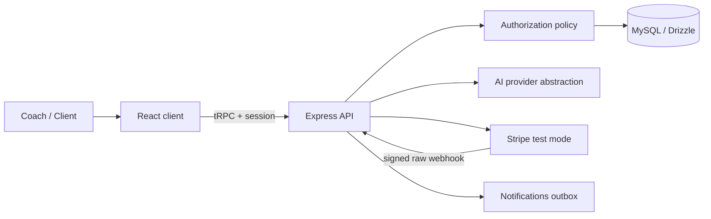
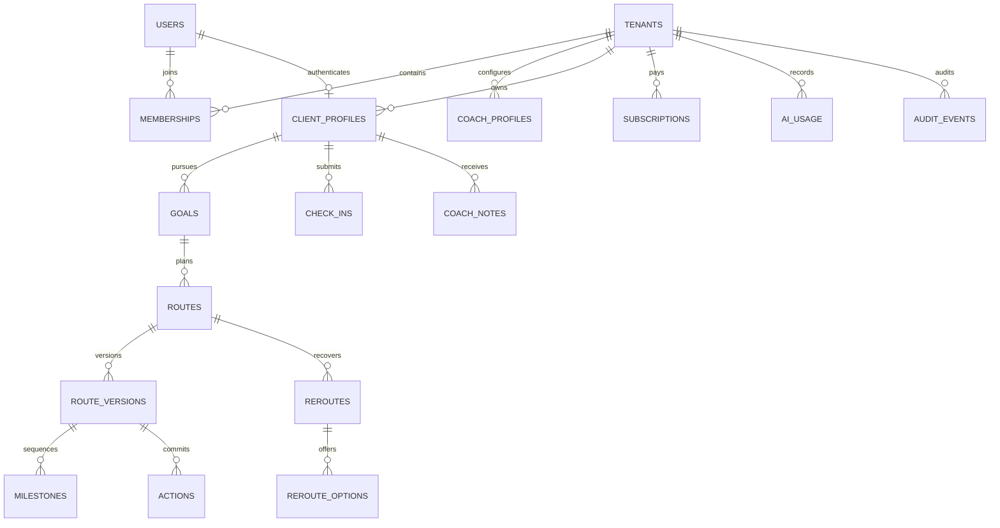

# VisionRoute Architecture and Data Model

## System boundaries

The browser is not trusted for tenant selection, role selection or object ownership. The server maps an authenticated identity to a tenant membership, derives a `TenantScope`, and only then runs a tenant-bound domain service.

## Core relationship diagram

## Entity notes

| Domain | Records | Notes |
|---|---|---|
| Identity | `users`, `memberships`, `coach_profiles`, `client_profiles`, `invitations` | Global identities are separate from tenant roles. Invitation tokens are SHA-256 digests; plaintext tokens are returned once only. |
| Planning | `goals`, `routes`, `route_versions`, `milestones`, `actions`, `action_events` | A route has immutable version snapshots. Actions preserve completion/missed history. |
| Coaching cadence | `check_ins`, `reroutes`, `reroute_options`, `coach_notes` | Client reports remain source records. Major reroute options require coach approval. |
| AI | `ai_summaries`, `ai_usage` | Bounded structured context and operational usage, not unbounded transcript storage. |
| Platform support | `subscriptions`, `processed_webhook_events`, `notifications`, `analytics_events`, `audit_events`, `templates` | Billing is tenant-owned; events are de-duplicated; analytics metadata is content-minimized. |

## Route, check-in and reroute state

1. Intake creates/updates a `goal` and preserves client constraints/capacity.
2. The planning service generates a `route` in `proposed` state, a `route_version`, sequenced milestones and actions.
3. A coach approves the route. Only `approved` route state is returned to client-role readers.
4. Completing an action adds an immutable `action_event`; dashboard progress is derived from action status.
5. A weekly `check_in` stores the client’s original report and a separately labelled summary.
6. A missed action or request opens a `reroute` with four `reroute_options`.
7. Coach approval creates a new approved route version and leaves the prior version as history.

## AI boundary

`AIProvider` is the only domain boundary that speaks to an LLM. `AI_MODEL_REGISTRY` selects a feature-specific model with environment overrides. The route response is schema-validated with Zod. If the configured model or response is unavailable, the deterministic planning engine creates a transparent safe fallback route. Human approval remains required for consequential decisions.

## Future-safe design decisions

- Tenant IDs exist on all account-owned records.
- Memberships separate identity from tenant role and can support more coaches/organizations later.
- Route versions, milestones and action dependencies allow future programs, recurring work, competitions and templates without changing the basic engine.
- Branding and terminology are tenant configuration rather than separate code paths.
- Subscription, notification, audit and AI usage records are extensible without introducing a CRM.
